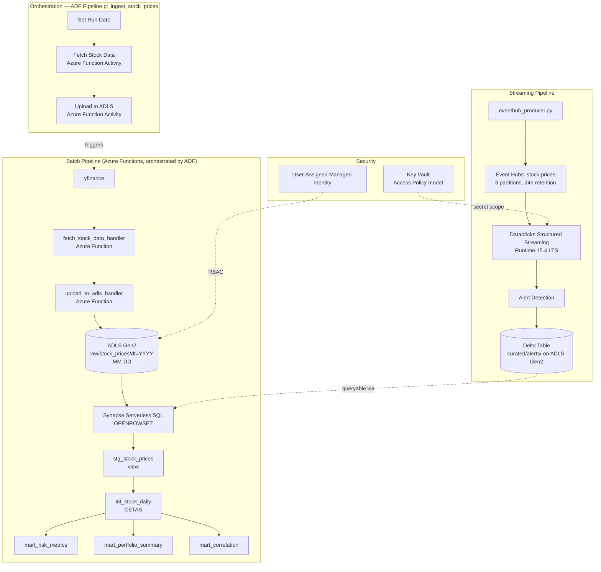

# Scottish Equity Risk Pipeline (Azure)

A fully Azure-native data pipeline that tracks 8 Scottish-listed equities, computes daily risk metrics through a serverless-SQL batch pipeline, streams real-time prices through Event Hubs and Databricks Structured Streaming, and is orchestrated end-to-end with Azure Data Factory.

---

## Business Problem

This project simulates a real-world equity risk monitoring system for a portfolio of 8 Scottish-listed equities:

- Portfolio managers need daily risk metrics (volatility, VaR 95%, Sharpe ratio, max drawdown) to assess exposure and make informed allocation decisions
- Risk teams require real-time alerts when price movements breach defined thresholds
- A unified batch + streaming architecture enables both historical analysis and live monitoring within a single data platform

---

## Architecture



---

## Tech Stack

| Layer | Technology |
|---|---|
| Ingestion compute | Azure Functions (Python 3.11, Consumption/Flex Consumption plan) |
| Object Storage | ADLS Gen2 (UK South), Parquet |
| Data Warehouse | Synapse Analytics — Serverless SQL Pool |
| Transformation | Hand-written CETAS SQL scripts (Phase 1), Fabric DW + dbt adapter (Phase 2, planned) |
| Orchestration | Azure Data Factory |
| Streaming Broker | Azure Event Hubs (Standard tier) |
| Stream Processing | Databricks Structured Streaming (Runtime 15.4 LTS, Scala 2.12) |
| Streaming Connector | `azure-eventhubs-spark` (native, not Kafka-compatible endpoint) |
| Secrets & Identity | Azure Key Vault, Managed Identity, `DefaultAzureCredential` |
| CI/CD | GitHub Actions, ruff, pytest, OIDC federated deployment |

---

## Equities Tracked

Defined centrally in `config/tickers.yaml`:

| Ticker | Company |
|---|---|
| `NWG.L` | NatWest Group |
| `ABDN.L` | abrdn plc |
| `SMT.L` | Scottish Mortgage Investment Trust |
| `MNKS.L` | Monks Investment Trust |
| `AV.L` | Aviva |
| `HIK.L` | Hikma Pharmaceuticals |
| `SSE.L` | SSE plc |
| `WEIR.L` | Weir Group |

---

## Key Design Decisions & Trade-offs

**Databricks over a pure Synapse-only stack** — Databricks was deliberately kept in an otherwise Azure-native pipeline because Structured Streaming + Delta Lake is its native strength, and the `azure-eventhubs-spark` connector demonstrates real Spark/Event Hubs integration rather than routing through Kafka-compatibility shims.

**Runtime 15.4 LTS, not 17.3 LTS** — Runtime 17.3 LTS ships Scala 2.13, which `azure-eventhubs-spark` does not yet support. This is a concrete example of checking connector compatibility against a specific runtime's Scala version *before* provisioning, rather than defaulting to the newest LTS.

**Key Vault Access Policy model, not Azure RBAC** — Databricks-backed secret scopes require the legacy Vault access-policy model; Azure RBAC alone is not sufficient for this integration. Also, Unity Catalog in **Standard** access mode blocks Maven library installation for the Event Hubs connector — **Dedicated** access mode was required.

**Synapse is an analytics engine, not storage** — data lives in ADLS Gen2 as the source of truth; streaming alerts are written as Delta tables directly to ADLS Gen2, and queried by Synapse Serverless SQL via `OPENROWSET` rather than being loaded *into* Synapse itself.

**CETAS instead of dbt (Phase 1)** — the official `dbt-synapse` adapter only supports Dedicated SQL Pools, and Serverless SQL doesn't support `CREATE TABLE AS SELECT`, only `CREATE EXTERNAL TABLE AS SELECT`. Rather than provision a Dedicated Pool purely to unlock dbt tooling, Phase 1 hand-writes CETAS-based SQL to implement a layered RAW → STAGING → CORE → MARTS model (`stg_stock_prices`, `int_stock_daily`, `mart_risk_metrics`, `mart_portfolio_summary`, `mart_correlation`). Phase 2 (planned) integrates Microsoft Fabric Data Warehouse with the official dbt adapter, moving from hand-rolled to tool-assisted modelling.

**No built-in `CORR()` in T-SQL** — Serverless SQL has no native correlation function. `mart_correlation` uses a self-join on `symbol_1 < symbol_2` and a manually derived Pearson correlation formula built from `SUM`/`COUNT` primitives; all 28 pairwise coefficients validated to fall within `[-1, 1]`.

**OIDC over Publish Profile for deployment** — a Publish Profile is the simpler path, but it's a long-lived secret. OIDC via an Azure AD App Registration + Federated Credential (scoped to the `main` branch of this repo) issues short-lived tokens per run instead, and the RBAC role (`Website Contributor`) is scoped to the single Function App rather than the subscription or resource group — least-privilege, and consistent with the `DefaultAzureCredential`/RBAC pattern used everywhere else in the project.

**ADF expression syntax** — inside a mixed-text JSON activity body, expressions must be wrapped in `@{...}`; a bare `@activity(...)` is not evaluated and silently passes an empty string downstream. This only surfaces when the body is a text template rather than a pure expression field.

---

## Challenges & Solutions

| Challenge | Root Cause | Solution |
|---|---|---|
| `dbt-synapse` adapter unusable | Adapter requires Dedicated SQL Pool; project uses Serverless (no `CTAS`, only `CETAS`) | Hand-wrote CETAS-based layered SQL for Phase 1; deferred dbt integration to a Fabric DW-based Phase 2 |
| CETAS rerun fails with "External table location already exists" | `DROP EXTERNAL TABLE` only removes metadata, not the underlying Parquet files in ADLS | Manually delete the model's folder in ADLS (via Synapse Studio's Data > Linked pane) before recreating; use `IF OBJECT_ID('schema.table','U') IS NOT NULL DROP ...` since `DROP EXTERNAL TABLE` doesn't support `IF EXISTS` |
| Databricks secret scope creation failed against RBAC-only Key Vault | Key Vault-backed secret scopes require the legacy Access Policy model | Reconfigured Key Vault to the Access Policy model |
| Maven library install blocked on Databricks cluster | Unity Catalog Standard access mode restricts library sources | Switched cluster to Dedicated access mode |
| Event Hubs connector failed to load | Databricks Runtime 17.3 LTS uses Scala 2.13; `azure-eventhubs-spark` only supports 2.12 | Provisioned cluster on Runtime 15.4 LTS instead |
| Two ADF Function Activities failed auth against one Linked Service | A function-level key is scoped to a single Azure Function; both Activities shared one Linked Service | Switched authentication to the Function App–level Host key (App keys → default) |
| Downstream ADF Activity received an empty string | Bare `@activity(...)` isn't evaluated inside a mixed-text JSON body | Wrapped the expression as `@{activity(...).output...}` |
| **Secret leaked to GitHub** — a Function Host key was hardcoded in `functions/test_pipeline_cloud.py` and caught by GitHub Push Protection (GH013) before the push completed | Test script committed with a real credential inline | 1) Immediately renewed the Host key in the Portal to invalidate the leaked value, 2) refactored the script to read `os.getenv("TEST_FUNCTION_KEY", "")`, 3) stored the new key as a local environment variable, 4) `git reset --soft HEAD~1` to drop the leaked commit entirely, then re-committed and pushed a clean version |

---

## CI/CD — GitHub Actions

`.github/workflows/lint.yml` runs a three-stage pipeline on every push to `main`, each stage gating the next:

1. **`lint`** — `ruff check` + `ruff format`
2. **`test`** — `pytest tests/`, covering the ingestion and upload logic with mocked Azure SDK clients
3. **`deploy`** — runs only after `test` passes (not `lint` — an earlier misconfiguration where `deploy` depended on `lint` was corrected so the full chain is enforced), authenticates via OIDC (`azure/login@v2`), and deploys to `func-scottish-equity-risk` via `Azure/functions-action@v1`

**Why OIDC:** three non-sensitive identifiers (`AZURE_CLIENT_ID`, `AZURE_TENANT_ID`, `AZURE_SUBSCRIPTION_ID`) are stored as GitHub repository secrets — no long-lived credential is stored anywhere. The Federated Credential is bound to this repository's `main` branch specifically, and the associated RBAC role (`Website Contributor`) is scoped to the single Function App.

Lint and test are deliberately separated as distinct quality gates rather than treated as one step: lint catches style/formatting issues, test verifies logical correctness — different failure modes, worth failing independently and visibly.

---

## Project Structure

<details>
<summary>Click to expand</summary>

```
scottish-equity-risk-pipeline-azure/
├── .github/
│   └── workflows/
│       └── lint.yml                    # lint → test → deploy (OIDC)
├── ingestion/
│   ├── fetch_stock_data.py             # Pull OHLCV data from yfinance
│   └── upload_to_adls.py               # Upload Parquet to ADLS Gen2
├── functions/
│   ├── function_app.py                 # HTTP handler layer
│   ├── pipeline/
│   │   ├── fetch_logic.py              # Business logic, called by function_app.py
│   │   └── upload_logic.py
│   ├── config/
│   │   └── tickers.yaml
│   └── requirements.txt
├── streaming/
│   ├── eventhub_producer.py            # Simulated price feed to Event Hubs
│   └── databricks_streaming_consumer.py # Structured Streaming + alert detection
├── synapse/
│   ├── setup/
│   │   └── 01_setup.sql
│   └── models/
│       ├── staging/
│       │   └── stg_stock_prices.sql    # View, OPENROWSET
│       ├── core/
│       │   └── int_stock_daily.sql     # CETAS, daily returns
│       └── marts/
│           ├── mart_risk_metrics.sql
│           ├── mart_portfolio_summary.sql
│           └── mart_correlation.sql
├── config/
│   └── tickers.yaml
├── tests/
│   ├── test_fetch_stock_data.py
│   └── test_upload_to_adls.py
├── docs/                               # Validation screenshots
├── pyproject.toml                      # ruff config
└── README.md
```

</details>

---

## Cost Management

This project runs on a Pay-As-You-Go subscription, and several components are provisioned only when actively needed:

- **Event Hubs (Standard tier)** bills hourly regardless of usage. The namespace is created before streaming work and deleted immediately after (accumulated ~£1.80 before the first teardown) — the config (Standard, UK South, `stock-prices`, 3 partitions, 24h retention) is documented here for quick recreation.
- **Databricks cluster** is stopped when not actively streaming.
- **Function App, Storage, Synapse Serverless, Key Vault, Application Insights** are consumption-based and require no manual idle management.
- The ADF Schedule Trigger (`tr_daily_stock_ingest`, daily 17:00 UK time) is fully configured but kept **Stopped** — this is a portfolio project, not a production system, so there's no need for it to run unattended and accrue cost.

---

## Future Work

- **Phase 2**: integrate Microsoft Fabric Data Warehouse and run the official `dbt-fabric`/`dbt-synapse` adapter for a full standard dbt project, moving beyond the hand-written CETAS approach
- Synapse Studio native Git integration (GitHub or Azure DevOps) — deferred since current Synapse assets are plain SQL scripts under local git, not Synapse-managed artifacts
- Visualisation/BI layer (interactive dashboard for portfolio risk metrics)

---

## Disclaimer

This project is built for portfolio purposes only.
Stock data is sourced via [yfinance](https://github.com/ranaroussi/yfinance), which retrieves publicly available market data from Yahoo Finance.
This project is not intended for commercial use.